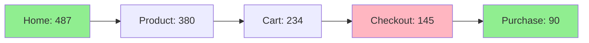
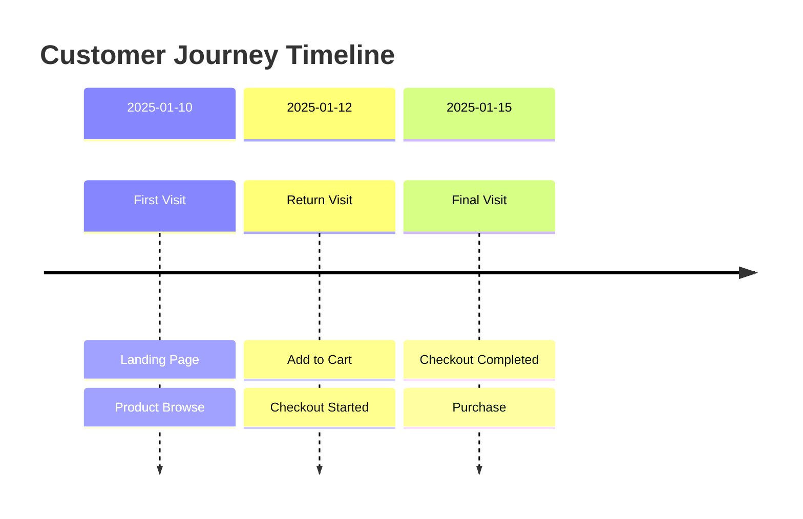
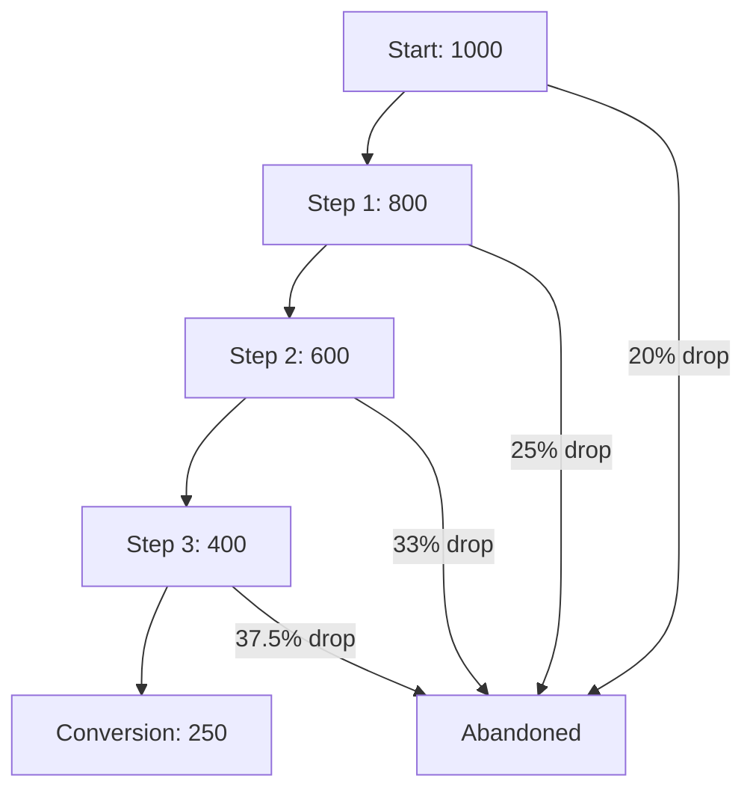

# Obsidian Vault Structure for Customer Journey Tool

## Overview

This document specifies the folder structure and markdown templates for storing customer journey analytics data in your local Obsidian vault.

---

## Vault Folder Structure

```
ObsidianVault/
├── customer_journeys/
│   ├── _index.md                           # Main index with navigation
│   │
│   ├── daily_reports/                      # Daily automated summaries
│   │   ├── 2025-01-15-journey-summary.md
│   │   ├── 2025-01-16-journey-summary.md
│   │   └── ...
│   │
│   ├── customer_profiles/                  # Individual customer journey maps
│   │   ├── customer_12345.md
│   │   ├── customer_67890.md
│   │   └── ...
│   │
│   ├── funnel_analysis/                    # Conversion funnel reports
│   │   ├── checkout_funnel_weekly.md
│   │   ├── signup_funnel_daily.md
│   │   ├── product_browsing_funnel.md
│   │   └── ...
│   │
│   ├── dropoff_alerts/                     # Abnormal drop-off alerts
│   │   ├── 2025-01-15-checkout-spike.md
│   │   ├── 2025-01-16-form-errors.md
│   │   └── ...
│   │
│   ├── insights/                           # AI-generated insights
│   │   ├── high_value_customer_patterns.md
│   │   ├── mobile_vs_desktop_comparison.md
│   │   ├── optimization_recommendations.md
│   │   └── ...
│   │
│   ├── heatmaps/                          # Heatmap analysis reports
│   │   ├── homepage_clicks.md
│   │   ├── checkout_page_interactions.md
│   │   └── ...
│   │
│   └── segments/                          # Customer segment analysis
│       ├── high_ltv_customers.md
│       ├── cart_abandoners.md
│       ├── mobile_users.md
│       └── ...
│
└── templates/                             # Template files (optional)
    └── customer_journey_templates/
        ├── daily_report.md
        ├── customer_profile.md
        ├── funnel_analysis.md
        └── dropoff_alert.md
```

---

## File Naming Conventions

### Date-Based Files
- Format: `YYYY-MM-DD-description.md`
- Examples:
  - `2025-01-15-journey-summary.md`
  - `2025-01-16-checkout-spike.md`

### Entity-Based Files
- Format: `entity_type_identifier.md`
- Examples:
  - `customer_12345.md`
  - `checkout_funnel_weekly.md`
  - `high_ltv_customers.md`

### Segment Files
- Format: `segment_name.md`
- Examples:
  - `mobile_users.md`
  - `cart_abandoners.md`
  - `first_time_visitors.md`

---

## Frontmatter Standards

All customer journey notes should include YAML frontmatter for metadata and Obsidian features:

```yaml
---
# Core Metadata
type: customer_journey_report  # or: customer_profile, funnel_analysis, dropoff_alert, insight
created: 2025-01-15T10:00:00Z
updated: 2025-01-15T14:30:00Z

# Tags for Organization
tags:
  - customer-journey
  - analytics
  - [specific-tag]

# Report-Specific Metadata
report_type: daily_summary  # or: weekly, monthly, custom
date_range_start: 2025-01-15
date_range_end: 2025-01-15
total_sessions: 487
total_conversions: 23
conversion_rate: 4.7

# Status
status: published  # or: draft, archived
priority: normal   # or: high, low

# Relationships (for linking)
related_funnels:
  - "[[funnel_analysis/checkout_funnel_weekly]]"
related_alerts:
  - "[[dropoff_alerts/2025-01-15-checkout-spike]]"
---
```

---

## Wikilink Standards

### Internal Links
- Use Obsidian wikilinks: `[[path/to/note]]`
- Relative paths from vault root: `[[customer_journeys/customer_profiles/customer_12345]]`
- With aliases: `[[customer_journeys/customer_profiles/customer_12345|Customer #12345]]`

### Section Links
- Link to specific sections: `[[note#Section Heading]]`
- Example: `[[daily_reports/2025-01-15-journey-summary#Drop-off Analysis]]`

### Cross-References
All reports should link to related entities:
- Customer profiles → Sessions, Funnels
- Daily reports → Customer profiles, Alerts
- Funnel analysis → Related customers, Alerts
- Alerts → Affected funnels, Customer segments

---

## Mermaid Diagram Standards

### Journey Flow Diagrams (Sankey-style)


### Timeline Diagrams


### Funnel Diagrams


---

## Metadata Tables

### Customer Attributes Table
```markdown
| Attribute | Value |
|-----------|-------|
| Customer ID | 12345 |
| LTV | $1,245.00 |
| Order Count | 3 |
| Last Visit | 2025-01-15 |
| Device Type | Desktop |
| Location | New York, US |
| Loyalty Tier | Gold |
```

### Funnel Metrics Table
```markdown
| Step | Entered | Completed | Drop-off Rate | Avg Time |
|------|---------|-----------|---------------|----------|
| 1. Home | 1000 | 800 | 20% | 45s |
| 2. Product | 800 | 600 | 25% | 2m 15s |
| 3. Cart | 600 | 400 | 33% | 1m 30s |
| 4. Checkout | 400 | 250 | 37.5% | 3m 45s |
```

---

## Callout Blocks (Obsidian Feature)

### Alert Callouts
```markdown
> [!warning] High Drop-off Detected
> Checkout page abandonment increased by 45% compared to baseline.
> **Affected Users:** 127 in last 24 hours
> **Primary Reason:** Form validation errors on shipping address
```

### Insight Callouts
```markdown
> [!tip] Optimization Opportunity
> Mobile users have 35% higher cart abandonment than desktop.
> **Recommendation:** Simplify mobile checkout flow, reduce form fields.
```

### Success Callouts
```markdown
> [!success] Improved Conversion
> Signup funnel conversion rate increased from 12% to 18% after form redesign.
```

---

## Dataview Query Examples (Optional - if using Dataview plugin)

### Recent Alerts Query
```dataview
TABLE
  report_type as "Type",
  total_sessions as "Sessions",
  conversion_rate as "Conv Rate"
FROM "customer_journeys/dropoff_alerts"
WHERE date(created) >= date(today) - dur(7 days)
SORT created DESC
LIMIT 10
```

### High-Value Customers Query
```dataview
TABLE
  ltv as "LTV",
  order_count as "Orders",
  last_visit as "Last Visit"
FROM "customer_journeys/customer_profiles"
WHERE ltv > 500
SORT ltv DESC
```

---

## File Size Guidelines

### Target File Sizes
- **Daily Reports:** 2-5 KB (500-1500 words)
- **Customer Profiles:** 3-8 KB (800-2000 words)
- **Funnel Analysis:** 4-10 KB (1000-2500 words)
- **Alerts:** 1-3 KB (300-800 words)
- **Insights:** 5-15 KB (1500-4000 words)

### Media Inclusion
- **Heatmap Images:** Embed as PNG, max 500 KB
- **Journey Diagrams:** Use Mermaid (text-based, no images)
- **Screenshots:** Only for critical UX issues, max 300 KB each

---

## Update Frequency

### Automated Updates
- **Daily Reports:** Generated every day at 2:00 AM (configurable)
- **Funnel Analysis:** Updated every hour (cached)
- **Customer Profiles:** Updated on each session end
- **Alerts:** Real-time (triggered by thresholds)

### Manual Updates
- **Insights:** Generated on-demand via agent query
- **Segment Analysis:** Generated weekly or on-demand

---

## Archive Strategy

### Monthly Archives
After 30 days, move old reports to archive folder:
```
customer_journeys/
└── archives/
    ├── 2024-12/
    │   ├── daily_reports/
    │   ├── dropoff_alerts/
    │   └── funnel_analysis/
    └── 2025-01/
        └── ...
```

### Retention Policy
- **Daily Reports:** Keep 90 days, then archive
- **Customer Profiles:** Keep indefinitely (active customers)
- **Alerts:** Keep 60 days, then archive
- **Insights:** Keep indefinitely
- **Heatmaps:** Keep 30 days, then archive

---

## Search Tags

### Primary Tags
- `#customer-journey` - All journey-related notes
- `#analytics` - All analytics reports
- `#conversion` - Conversion-related insights
- `#dropoff` - Drop-off and abandonment
- `#optimization` - Optimization recommendations

### Secondary Tags
- `#mobile` - Mobile-specific analysis
- `#desktop` - Desktop-specific analysis
- `#high-value` - High LTV customers
- `#cart-abandonment` - Cart abandonment issues
- `#checkout` - Checkout flow issues
- `#form-errors` - Form validation problems
- `#rage-clicks` - User frustration indicators

### Status Tags
- `#action-required` - Needs immediate attention
- `#monitoring` - Under observation
- `#resolved` - Issue resolved
- `#archived` - Archived report

---

## Integration with Obsidian Features

### Graph View
- Customer profiles link to their sessions
- Daily reports link to affected customers
- Funnels link to customer segments
- Creates a knowledge graph of customer behavior

### Canvas
Create visual journey maps on Obsidian Canvas:
- Drag customer profile cards
- Connect with journey flow arrows
- Annotate with insights

### Daily Notes Integration
Link customer journey insights to your daily notes:
```markdown
# 2025-01-15

## Customer Journey Insights
- [[customer_journeys/daily_reports/2025-01-15-journey-summary|Today's Journey Summary]]
- Action: Investigate checkout abandonment spike (45% increase)
```

---

## Backup Strategy

### Local Backups
- Obsidian vault is already local (inherent backup)
- Enable Obsidian sync or use git for version control

### Git Integration (Recommended)
```bash
# Initialize git in vault
cd /path/to/ObsidianVault
git init
git add customer_journeys/
git commit -m "Initial customer journey data"

# Daily automated commits
git add customer_journeys/daily_reports/
git commit -m "Daily journey report $(date +%Y-%m-%d)"
git push origin main
```

---

## Example Vault State

After 1 week of operation:
```
customer_journeys/
├── _index.md (1 KB)
├── daily_reports/ (7 files, ~25 KB total)
├── customer_profiles/ (~50 files, ~250 KB total)
├── funnel_analysis/ (5 files, ~40 KB total)
├── dropoff_alerts/ (12 files, ~24 KB total)
├── insights/ (3 files, ~30 KB total)
├── heatmaps/ (8 files, ~15 KB total)
└── segments/ (4 files, ~20 KB total)

Total: ~404 KB (~89 files)
```

After 1 month:
```
Total: ~1.5 MB (~300 files)
```

Very manageable for Obsidian!

---

## Next Steps

1. **Create Base Folders:** Run setup script to create folder structure
2. **Install Obsidian Plugins (Optional but Recommended):**
   - Dataview (for dynamic queries)
   - Templater (for template automation)
   - Calendar (for date-based navigation)
   - Graph Analysis (for journey visualization)
3. **Configure Automated Sync:** Set up the Customer Journey Tool to write to your vault
4. **Create Templates:** Copy template files to `templates/customer_journey_templates/`
5. **Test Integration:** Generate first daily report and verify it appears in vault

---

**This structure ensures your customer journey data is well-organized, searchable, and fully integrated with Obsidian's powerful features!**
