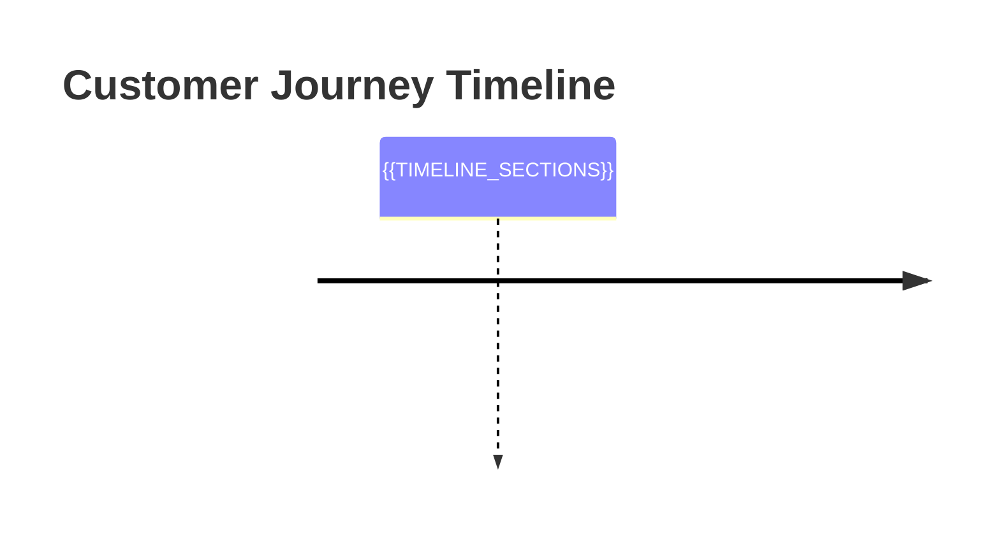

# Customer Profile: #{{CUSTOMER_ID}}

> [!info] Customer Overview
> **Customer ID:** {{CUSTOMER_ID}}
> **Status:** {{STATUS}} ({{CONVERSION_STATUS}})
> **Loyalty Tier:** {{LOYALTY_TIER}}
> **Lifetime Value:** ${{LTV}}

---

## Customer Attributes

### Demographics

| Attribute | Value |
|-----------|-------|
| **Location** | {{CITY}}, {{COUNTRY}} |
| **Language** | {{LANGUAGE}} |
| **Age** | {{AGE}} |
| **Gender** | {{GENDER}} |
| **Timezone** | {{TIMEZONE}} |

### Behavioral Metrics

| Metric | Value |
|--------|-------|
| **First Visit** | {{FIRST_VISIT_DATE}} |
| **Last Visit** | {{LAST_VISIT_DATE}} |
| **Days Since Last Visit** | {{DAYS_SINCE_LAST_VISIT}} |
| **Total Visits** | {{VISIT_COUNT}} |
| **Total Pages Viewed** | {{PAGES_VIEWED}} |
| **Avg Session Duration** | {{AVG_SESSION_DURATION}} |
| **Total Time on Site** | {{TOTAL_TIME_ON_SITE}} |

### Transactional Metrics

| Metric | Value |
|--------|-------|
| **Lifetime Value (LTV)** | ${{LTV}} |
| **Total Orders** | {{ORDER_COUNT}} |
| **Avg Order Value** | ${{AVG_ORDER_VALUE}} |
| **Last Purchase** | {{LAST_PURCHASE_DATE}} |
| **Cart Abandonments** | {{CART_ABANDONMENT_COUNT}} |

### Engagement Indicators

| Metric | Value |
|--------|-------|
| **Email Subscriber** | {{EMAIL_SUBSCRIBER}} |
| **Loyalty Tier** | {{LOYALTY_TIER}} |
| **Engagement Score** | {{ENGAGEMENT_SCORE}}/100 |
| **Churn Risk** | {{CHURN_RISK_PERCENT}}% ({{CHURN_RISK_LABEL}}) |
| **Conversion Probability** | {{CONVERSION_PROBABILITY}}% |

{{#if HIGH_CHURN_RISK}}
> [!warning] High Churn Risk
> This customer has a {{CHURN_RISK_PERCENT}}% churn probability.
> **Recommended Actions:**
> - Send re-engagement email campaign
> - Offer personalized discount (10-15%)
> - Review last session for friction points
{{/if}}

### Device & Technology

| Attribute | Value |
|-----------|-------|
| **Primary Device** | {{DEVICE_TYPE}} |
| **Operating System** | {{OS}} |
| **Browser** | {{BROWSER}} |
| **Screen Resolution** | {{SCREEN_RESOLUTION}} |

---

## Acquisition Context

### Initial Traffic Source

| Attribute | Value |
|-----------|-------|
| **Source** | {{UTM_SOURCE}} |
| **Medium** | {{UTM_MEDIUM}} |
| **Campaign** | {{UTM_CAMPAIGN}} |
| **Referrer** | {{REFERRER}} |
| **Landing Page** | {{LANDING_PAGE}} |

{{#if UTM_CAMPAIGN}}
**Campaign Details:** Customer was acquired through the "{{UTM_CAMPAIGN}}" campaign via {{UTM_MEDIUM}}.
{{/if}}

---

## Complete Journey Timeline



### Journey Summary

- **Journey Start:** {{FIRST_VISIT_DATE}}
- **Journey Duration:** {{JOURNEY_DURATION_DAYS}} days
- **Total Sessions:** {{SESSION_COUNT}}
- **Total Events:** {{TOTAL_EVENTS_COUNT}}
- **Journey Status:** {{JOURNEY_STATUS}}

{{#if CONVERTED}}
- **Conversion Date:** {{CONVERSION_DATE}}
- **Time to Conversion:** {{TIME_TO_CONVERSION_HOURS}} hours
- **Conversion Value:** ${{CONVERSION_VALUE}}
{{/if}}

---

## Session History

{{#each SESSIONS}}
### Session {{this.number}}: {{this.date}}

**Duration:** {{this.duration}} | **Pages:** {{this.pages_count}} | **Outcome:** {{this.outcome}}

**Journey:**
```
{{this.page_flow}}
```

{{#if this.converted}}
> [!success] Conversion
> **Order Value:** ${{this.order_value}}
> **Products:** {{this.products}}
{{/if}}

{{#if this.abandoned}}
> [!warning] Abandoned at {{this.dropoff_point}}
> **Reason:** {{this.dropoff_reason}}
{{/if}}

**Session Details:**
- Entry Page: {{this.entry_page}}
- Exit Page: {{this.exit_page}}
- Traffic Source: {{this.traffic_source}}
- Device: {{this.device_type}}
{{#if this.rage_clicks}}
- ⚠️ Rage clicks detected: {{this.rage_click_count}}
{{/if}}
{{#if this.form_errors}}
- ⚠️ Form errors: {{this.form_error_count}}
{{/if}}

---

{{/each}}

---

## Journey Visualization

### Path Sankey Diagram

```mermaid
graph LR
{{SANKEY_DIAGRAM_CONTENT}}
```

### Most Common Paths

{{#each COMMON_PATHS}}
{{this.rank}}. **{{this.path_description}}** ({{this.occurrence_count}}x)
   - {{this.path_detail}}
{{/each}}

---

## Purchase History

{{#if HAS_PURCHASES}}

### Orders

{{#each ORDERS}}
#### Order #{{this.order_id}} - {{this.date}}

| Attribute | Value |
|-----------|-------|
| **Order Total** | ${{this.total}} |
| **Items** | {{this.item_count}} |
| **Status** | {{this.status}} |

**Products:**
{{#each this.products}}
- {{this.name}} ({{this.quantity}}x) - ${{this.price}}
{{/each}}

**Journey to Purchase:**
- Sessions before purchase: {{this.sessions_before}}
- Time from first visit: {{this.time_from_first_visit}}

---

{{/each}}

{{else}}

> [!note] No Purchases Yet
> This customer has visited {{VISIT_COUNT}} times but not yet converted.
> {{#if CART_ABANDONMENT_COUNT}}
> **Cart abandonments:** {{CART_ABANDONMENT_COUNT}} times - consider retargeting campaign.
> {{/if}}

{{/if}}

---

## Behavioral Patterns

### Engagement Pattern

**Customer Type:** {{CUSTOMER_TYPE_LABEL}}

{{ENGAGEMENT_DESCRIPTION}}

### Browsing Behavior

**Top Pages Visited:**
{{#each TOP_PAGES}}
{{this.rank}}. {{this.page}} ({{this.visit_count}} visits)
{{/each}}

**Avg Time per Page:** {{AVG_TIME_PER_PAGE}}

### Shopping Behavior

{{#if HAS_CART_ACTIVITY}}
- **Add to Cart Events:** {{ADD_TO_CART_COUNT}}
- **Remove from Cart Events:** {{REMOVE_FROM_CART_COUNT}}
- **Cart Abandonment Rate:** {{CART_ABANDONMENT_RATE}}%

**Abandoned Cart History:**
{{#each ABANDONED_CARTS}}
- {{this.date}}: ${{this.cart_value}} ({{this.items_count}} items) - {{this.abandonment_reason}}
{{/each}}
{{/if}}

---

## Friction Points Detected

{{#if HAS_FRICTION_POINTS}}

{{#each FRICTION_POINTS}}
### {{this.type}}: {{this.location}}

> [!warning] Friction Detected
> **Severity:** {{this.severity}}
> **Occurrences:** {{this.count}}x
> **Last Seen:** {{this.last_occurrence}}
>
> **Details:**
> {{this.description}}
>
> **Impact:**
> {{this.impact}}

{{/each}}

{{else}}

> [!success] No Major Friction Points
> This customer has had a smooth experience with minimal issues.

{{/if}}

---

## Attribute Changes Over Time

### Evolution Timeline

{{#each ATTRIBUTE_CHANGES}}
- **{{this.timestamp}}:** {{this.attribute_name}} changed from `{{this.old_value}}` to `{{this.new_value}}`
  - Reason: {{this.change_reason}}
{{/each}}

### Key Milestones

{{#each MILESTONES}}
- **{{this.date}}:** {{this.milestone}}
{{/each}}

---

## Segment Membership

**Current Segments:**
{{#each SEGMENTS}}
- [[customer_journeys/segments/{{this.segment_id}}|{{this.segment_name}}]]
  - Joined: {{this.joined_date}}
  - Criteria: {{this.criteria}}
{{/each}}

---

## Predictive Insights

### Predictions (ML-Based)

| Prediction | Probability | Confidence |
|------------|-------------|------------|
| **Next Purchase (30 days)** | {{NEXT_PURCHASE_PROB}}% | {{NEXT_PURCHASE_CONFIDENCE}} |
| **Churn (90 days)** | {{CHURN_PROB}}% | {{CHURN_CONFIDENCE}} |
| **Upgrade to Higher Tier** | {{UPGRADE_PROB}}% | {{UPGRADE_CONFIDENCE}} |

### Recommended Actions

{{#each RECOMMENDED_ACTIONS}}
{{this.priority}}. **{{this.action}}**
   - Reason: {{this.reason}}
   - Expected Impact: {{this.impact}}
   - Timing: {{this.timing}}
{{/each}}

---

## Comparison to Cohort

**Cohort:** {{COHORT_NAME}} ({{COHORT_SIZE}} customers)

| Metric | This Customer | Cohort Avg | Percentile |
|--------|---------------|------------|------------|
| LTV | ${{LTV}} | ${{COHORT_AVG_LTV}} | {{LTV_PERCENTILE}}th |
| Orders | {{ORDER_COUNT}} | {{COHORT_AVG_ORDERS}} | {{ORDERS_PERCENTILE}}th |
| Engagement Score | {{ENGAGEMENT_SCORE}} | {{COHORT_AVG_ENGAGEMENT}} | {{ENGAGEMENT_PERCENTILE}}th |
| Avg Session Time | {{AVG_SESSION_DURATION}} | {{COHORT_AVG_SESSION}} | {{SESSION_PERCENTILE}}th |

{{#if ABOVE_AVERAGE_CUSTOMER}}
> [!tip] Above-Average Customer
> This customer performs better than {{BETTER_THAN_PERCENT}}% of their cohort.
> Consider for loyalty program upgrade or exclusive offers.
{{/if}}

---

## Related Notes

### Daily Reports
{{#each RELATED_DAILY_REPORTS}}
- [[customer_journeys/daily_reports/{{this.date}}-journey-summary|{{this.date}} Summary]]
{{/each}}

### Alerts
{{#each RELATED_ALERTS}}
- [[customer_journeys/dropoff_alerts/{{this.filename}}|{{this.title}}]]
{{/each}}

### Funnels
{{#each RELATED_FUNNELS}}
- [[customer_journeys/funnel_analysis/{{this.funnel_id}}|{{this.funnel_name}}]]
{{/each}}

---

## Custom Business Attributes

{{#if CUSTOM_ATTRIBUTES}}
{{#each CUSTOM_ATTRIBUTES}}
- **{{this.key}}:** {{this.value}}
{{/each}}
{{/if}}

---

## Data Summary

| Attribute | Value |
|-----------|-------|
| **Profile Created** | {{CREATED_TIMESTAMP}} |
| **Last Updated** | {{UPDATED_TIMESTAMP}} |
| **Data Completeness** | {{DATA_COMPLETENESS}}% |
| **Total Events Tracked** | {{TOTAL_EVENTS_COUNT}} |
| **Sessions Reconstructed** | {{SESSION_COUNT}} |

---

**Profile Generated by Customer Journey Analysis Tool**
*Powered by Pydantic AI + FastAPI*

---

## Navigation

[[customer_journeys/_index|Journey Index]] | [[customer_journeys/customer_profiles/|All Customers]]
